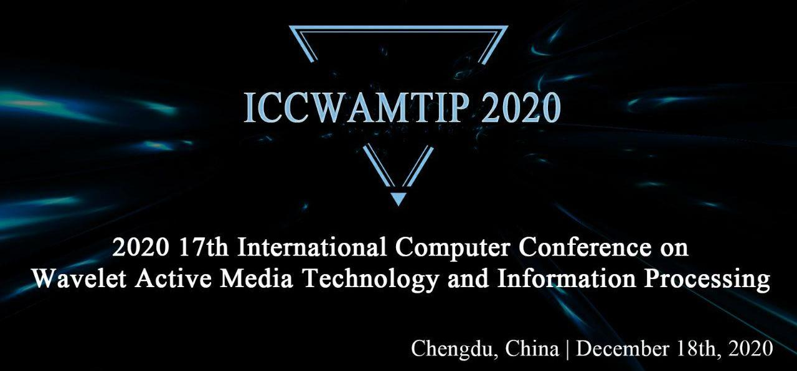

<figure class="image">
  
</figure>

## ICCWAMTIP 2020 | Chengdu, China | December 18th, 2020

ICCWAMTIP 2020, The 17th International Computer Conference on Wavelet Active Media Technology and Information Processing, will take place in Chengdu, China, from December 18th, 2020. This event is organized by University of Electronic Science and Technology of China(UESTC), sponsored by The National Natural Science Foundation of China(NSFC), National High Technology Research and Development Program of China and China International Talent Exchange Foundation. ICCWAMTIP 2020 is a not-to-be-missed opportunity that distills the most current knowledge on a rapidly advancing discipline in one conference. Join key researchers and established professionals in the field of information technologies as they assess the current state-of-the-art and roadmap crucial areas for future research.

We aim to building an idea-trading platform for the purpose of encouraging researcher participating in this event. The papers to be presented at ICCWAMTIP past conferences addressed many grand challenges in modern engineering.

The full papers to be presented will be peer-reviewed by expert reviewers including the whole organising committees members. We will be thankful for the contributions to ICCWAMTIP 2020. We look forward to your participation and continued engagement at future ICCWAMTIP conferences.

## Latest News

- Updated submission time from **Oct. 15th** to **Oct. 21th**
- Add WeChat QRCode contact method in [contact](/contact.html) page

## Important Dates

| Event              | Date                     |
|--------------------|--------------------------|
|Submission Deadline | **October 21th**, 2020   |
|Notification Date   | November 15th, 2020      |
|Conference Ceremony | December 18th, 2020      |

<!--
## CATALOG NUMBERS

Media Type Request | Part Number | ISBN | Print ISSN | Oline ISSN | Media Qty Request
--- | --- | --- | --- | --- | ---
XPLORE COMPLIANT | CFP19WAM-ART | 978-1-7281-4242-5 | --- | 2576-8964  | 3
CD-ROM | CFP19WAM-CDR | 978-1-7281-4240-1 | --- | --- | 5
PRINT | CFP19WAM-PRT | 978-1-7281-4241-8 | --- | --- | 2
-->

Any question, please [contact us](/contact.html) by Conferene E-mail and Phone Number.

