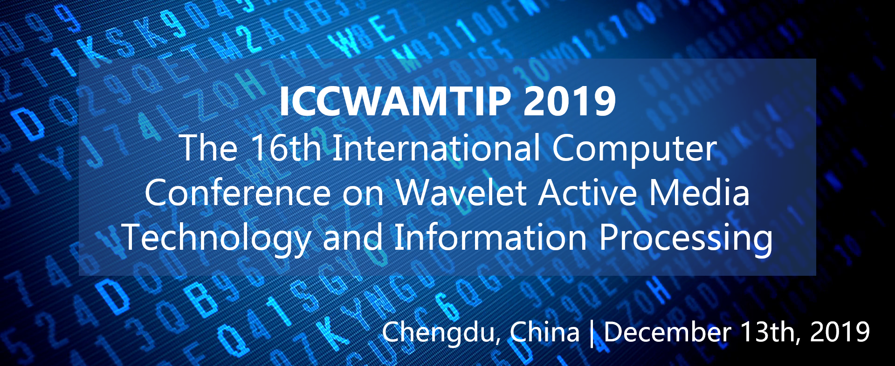

<figure class="image">
  
</figure>

## ICCWAMTIP 2019 | Chengdu, China | December 13th, 2019

ICCWAMTIP 2019, The 16th International Computer Conference on Wavelet Active Media Technology and Information Processing, will take place in Chengdu, China, from December 13th, 2019. This event is organized by University of Electronic Science and Technology of China(UESTC), sponsored by The National Natural Science Foundation of China(NSFC), National High Technology Research and Development Program of China and China International Talent Exchange Foundation. ICCWAMTIP 2019 is a not-to-be-missed opportunity that distills the most current knowledge on a rapidly advancing discipline in one conference. Join key researchers and established professionals in the field of information technologies as they assess the current state-of-the-art and roadmap crucial areas for future research.

We aim to building an idea-trading platform for the purpose of encouraging researcher participating in this event. The papers to be presented at ICCWAMTIP past conferences addressed many grand challenges in modern engineering.

The full papers to be presented will be peer-reviewed by expert reviewers including the whole organising committees members. We will be thankful for the contributions to ICCWAMTIP 2019. We look forward to your participation and continued engagement at future ICCWAMTIP conferences.

## Latest News

## Camera Ready Submission and the Invoice information (Dec. 3th update)

**These days please pay attention to your email inbox.**

Kindly do not forget to submit your Camera-Ready Submission, transfer paper fee, and the copyright before the deadline Dec.8th, which all can be done in the CMT system.

If you have transferred the money and need the invoice from our conference, please complete [this form](https://forms.office.com/Pages/ResponsePage.aspx?id=DQSIkWdsW0yxEjajBLZtrQAAAAAAAAAAAAN__gI7z2dUM1g4Vlc3VUYyTVRFUzRWVVQxV1FWUDlXMy4u) (Whether you have uploaded these information in the system, please help us to finish the form again, which is more convenient for us to collect information from you)

### About the paper status and notification (Nov. 20th update)

We are reviewing new papers now, it will take more time for us to finish the paper reviewing.

We assure we will finish the paper reviewing before Nov. 27th, after that you can check your paper status and the comments in the CMT system.

Also, we will send a notification to the primary author.

### About the submission deadline (Nov. 4th update)

In order to receive enough paper, we decide to put off the deadline to Nov. 20th.

Deadline extending doesn't affect the time of paper reviewing, we will still start reviewing on Nov. 6th.

If you can not finish the paper before the Nov. 20th, you can send the paper directly to our conference email.

## Important Dates

Event | Date
---- | ---
Submission Deadline	| **November 20th**, 2019
Notification Date | November 20th, 2019
Conference Ceremony | December 13th, 2019

## CATALOG NUMBERS

Media Type Request | Part Number | ISBN | Print ISSN | Oline ISSN | Media Qty Request
--- | --- | --- | --- | --- | ---
XPLORE COMPLIANT | CFP19WAM-ART | 978-1-7281-4242-5 | --- | 2576-8964  | 3
CD-ROM | CFP19WAM-CDR | 978-1-7281-4240-1 | --- | --- | 5
PRINT | CFP19WAM-PRT | 978-1-7281-4241-8 | --- | --- | 2

Any question, please [contact us](/contact.html) by Conferene E-mail and Phone Number.

