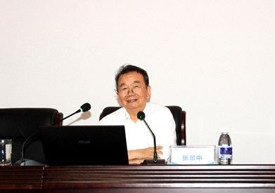
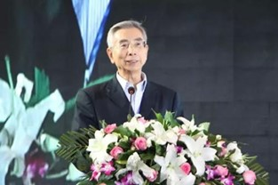
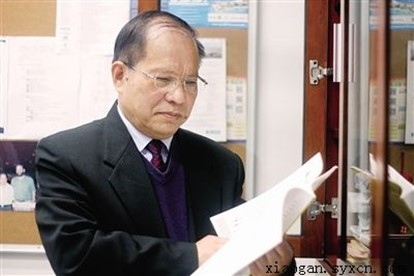
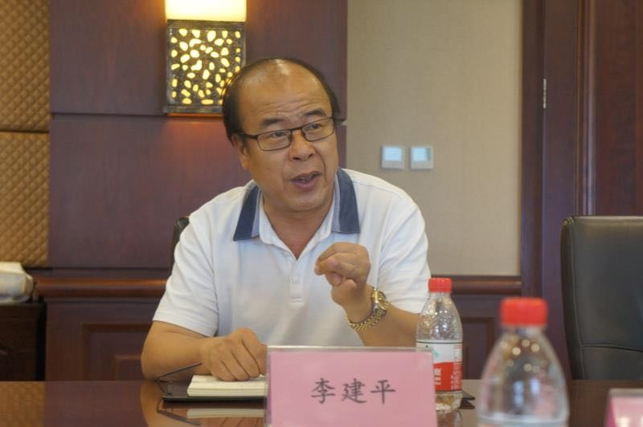

	

		

			

				<figure class="image">
					
				</figure>
			

			

        
Zhang Jingzhong, Professor

        
Academician of Chinese Academy of Sciences, Chengdu Computer Applications Institute, Chinese Academy of Sciences

			

		

		

			Zhang Jingzhong, Professor, Academician of Chinese Academy of Sciences, Computer Scientist, Mathematician, Mathematics Educator. Academician Zhang was Professor of University of Science and Technology of China at some time in the past, and now he is the head of automated reasoning union laboratory of University of Electronic Science and Technology of China and Chengdu Computer Applications Institute, Chinese Academy of Sciences, the honorary director of education software institute of Guangzhou University, the chairman of National Digit Learning Centre of Huazhong Normal University. Academician Zhang was engaged in computer science and mathematics for many years, he made rich achievements in machine proof, he was awarded National Prize of China for many times.
		

	

	

		

			

				<figure class="image">
					
				</figure>
			

			

        
Ni Guangnan, Professor

        
Academician of the Chinese Academy of Engineering, Institute of Computing Technology (ICT), Chinese Academy of Sciences (CAS)

			

		

		

			Mr. Ni Guangnan graduated from Southeast University in 1961. Since then he has been working in the Institute of Computing Technology (ICT), Chinese Academy of Sciences (CAS). He invented the LianXiang method for augmenting the input of Chinese. From 1984 to 1995 he acted as the CTO of ICTC, i.e. The Company of ICT which was renamed as Legend in 1989 and Lenovo recently. He led the development of Legend Chinese System and Legend Series PC, which were the key products of the company and won the first-class prize of the State Award for Scientific and Technological Achievement in 1988 and 1992 respectively. For years he devoted himself to the development of the homegrown core technology as well as the IT industry of China. In 1994 he was elected as the Academician of Chinese Academy of Engineering. He was rewarded the Lifetime Achievement Award by the Chinese Information Processing Society of China (CIPS) and China Computer Federation (CCF) in 2011 and 2015 respectively.
		

	

	

		

			

				<figure class="image">
					
				</figure>
			

			

        
Tang Yuanyan, Ph.D., Professor

        
Department of Computer and Information Science, Faculty of Science and Technology, University of Macau, Macau, China

			

		

		

			Tang Yuanyan is a Chair Professor in Faculty of Science and Technology at University of Macau and Professor/Adjunct Professor/Honorary Professor at several institutes in China, USA, Canada, France, and Hong Kong. His current interests include wavelets, pattern recognition, image processing, and artificial intelligence. He has published more than 400 academic papers and is the author/coauthor of over 25 monographs/books/bookchapters. He is the Founder and Editor-in-Chief of International Journal on Wavelets, Multiresolution, and Information Processing (IJWMIP), and Associate Editors of several international journals. He is the Founder and Chair of pattern recognition committee in IEEE SMC. He has serviced as general chair, program chair, and committee member for many international conferences. Dr. Tang is the Founder and General Chair of the series International Conferences on Wavelets Analysis and Pattern Recognition (ICWAPRs). He is the Founder and Chair of the Macau Branch of International Associate of Pattern Recognition (IAPR). Dr. Y. Y. Tang is a Fellow of IEEE, and Fellow of IAPR.
		

	

	

		

			

				<figure class="image">
					
				</figure>
			

			

        
Li Jianping, Ph.D., Professor

        
International Centre for Wavelet Analysis and Its applications,Big Data Research Institute, School of Computer Science,University of Electronic Science and Technology of China（UESTC）

			

		

		

			Professor Dr. Li Jianping, male, born on October 11,1964. He received the B.S. degree in applied mathematics from Chongqing University, Chongqing, China, in 1986, the M. Eng. degree in software engineering and M. Sci. degree in computational mathematics from the Graduate School of Xi'an Jiaotong University, Xi'an, Shanxi, China, in 1989, and the Ph.D. degree in computer science from  the Graduate School of Chongqing University, Chongqing, China, in 1998.  From 1999 to 2000, he was a post doctoral and visiting professor working at Hong Kong Baptist University under the leadership of Professor Dr. Yuan Yan Tang. From 2002 to 2003, 2005 to 2006, and in 2010, 2011, 2013, 2014, 2015,he was a senior visiting professor working respectively at Provence University, France, University of Guelph, Canada, Washington University, USA, University of Zurich, Switzerland. He is presently a Professor in International Centre for Wavelets Analysis and Its Applications (ICWAA) of University of Electronic Science and Technology of China（UESTC）, Chengdu, China, and as a head of ICWAA, he is the dean of Big Data Research Institute of UESTC. Dr. Li has served as a Syndic for Awards of National Science and Technology of China, a founder of the International Journal on Multiresolution, Wavelets, Applications (IJMWA), a founder and Editor in Chief of International Progress on Wavelet Active Media Technology and Information Processing, and also as General Chairman of many international conferences, a reviewer for many international famous Journals. His book Wavelet Analysis & Signal Processing: Theory, Applications & Software Implementations, was  awarded the second prize of National Science and Technology of China (1999), and it is very important reference for many scientists. Dr. Li has published more than 300 technical papers and is the author/ co-author of 30 books on subjects ranging from wavelet analysis and its applications to computer science. His current interests include wavelet theory and applications, fractal, image processing, pattern recognition, information security, big data, artificial intelligence.
		

	

